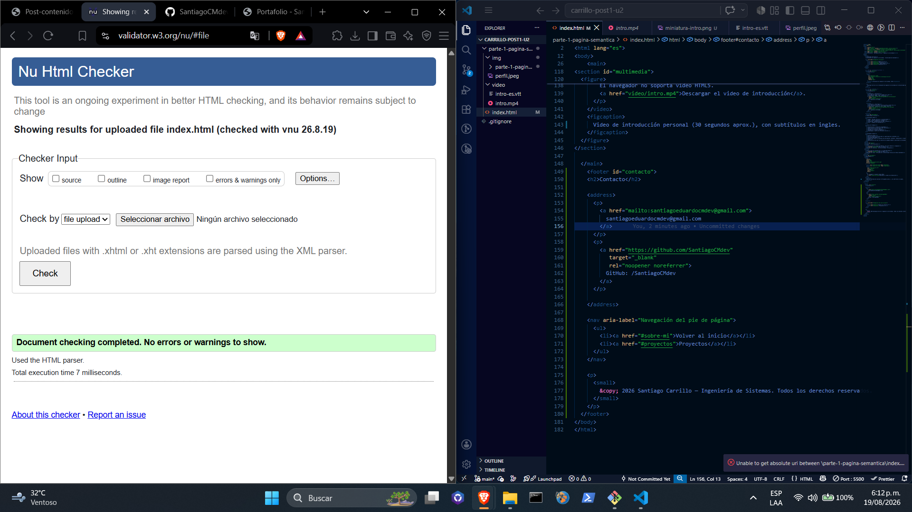
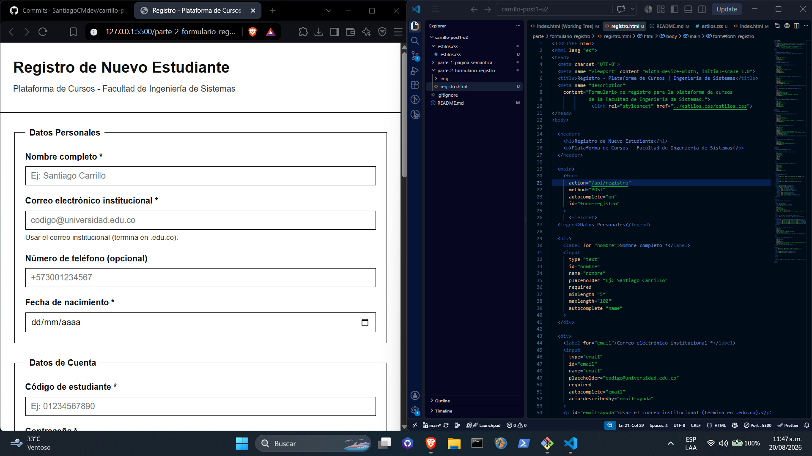

# Post-contenido - Unidad 2: HTML5 Básico - Santiago Carrillo

## Descripción
Repositorio del laboratorio de la Unidad 2 de Programación Web -
Séptimo Semestre. Contiene dos partes: página de portafolio con
etiquetas semánticas de HTML5 (parte-1-pagina-semantica/) y
formulario de registro con validación nativa HTML5
(parte-2-formulario-registro/).

## Parte 1 - Página semántica
Página de portafolio personal que implementa header, nav, main,
section, article, aside y footer, con listas ul/ol/dl, un bloque
de multimedia (video o audio) con su recurso de accesibilidad
asociado, una sección de preguntas frecuentes con details/summary,
y meta tags de SEO. Ver parte-1-pagina-semantica/.

## Parte 2 - Formulario de registro
Formulario de registro universitario con más de 10 tipos de
input HTML5 agrupados en fieldsets, con validación nativa y
atributos ARIA. Ver parte-2-formulario-registro/.

## Decisiones de diseño

### 1. Estructura semántica de "Logros y Certificaciones" (Parte 1)
Se eligió la **Opción A**: cada logro se marcó como un `<article>`
independiente. Se aplicó el criterio de la guía teórica "¿tiene
sentido por sí solo fuera del sitio?" y la respuesta fue sí: cada
certificación (institución emisora, fecha, contenido) es un dato
autocontenido que podría copiarse y compartirse fuera del portafolio
sin perder significado, tal como se comparte un certificado de forma
individual en LinkedIn o en una hoja de vida. Usar `<article>` en
lugar de una simple lista permite además que cada logro tenga su
propio encabezado (`<h3>`) y su propia marca temporal (`<time>`) de
forma explícita en el DOM.

### 2. Formato multimedia de la introducción personal (Parte 1)
Se eligió la **Opción A**: video con subtítulos WebVTT mediante
`<track kind="captions">`. Se prefirió el video sobre el audio porque
comunica más información en el mismo tiempo (expresión, entorno,
lenguaje corporal), lo cual resulta más natural para una introducción
personal en un portafolio. Como recurso de accesibilidad asociado
cumpliendo el principio "Perceptible" de WCAG se creó el archivo
`intro-es.vtt` con los cues sincronizados al audio del clip, de modo
que el contenido hablado también esté disponible como texto para
personas con discapacidad auditiva o en entornos sin sonido.

### 3. Marcado del campo opcional "teléfono" (Parte 2)
Se eligió la **Opción A**: texto visible "(opcional)" agregado
directamente en el contenido del `<label>` del campo teléfono. Esta
alternativa se prefirió porque hace evidente el carácter opcional del
campo para cualquier usuario con solo mirar el formulario, sin
depender de que el navegador o el lector de pantalla expongan
correctamente la relación `aria-describedby`. Al ser un formulario de
registro con varios campos obligatorios marcados con asterisco (*),
mantener una convención igual de visible y simple para lo opcional
da consistencia visual al conjunto.

## Cómo visualizar el proyecto
1. Clonar el repositorio: `git clone [URL-del-repo]`
2. Abrir la carpeta en Visual Studio Code
3. Clic derecho en index.html o registro.html → "Open with Live Server"

## Capturas de pantalla

